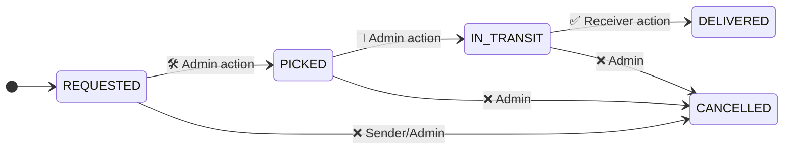

# Parcel Delivery API Documentation

**Base URL**: `https://parcel-delevery-backend.vercel.app/api/v1`

---


# 📦 Parcel Delivery Backend API

## 🚀 Project Overview
A RESTful API for parcel delivery management system with:

- 🔐 **User authentication** (JWT)
- 🛡️ **Role-based access control** (Admin/Sender/Receiver)
- 📦 **Parcel status tracking**
- 🗃️ **MongoDB database integration**
- ✅ **Zod schema validation**

[](https://github.com/masudsw/percel-delevary)

## 🛠️ Setup Instructions

Prerequisites:

- **Node.js v18+**
- **MongoDB Atlas account**
- **Git**

## 🛠️ Installation

```bash
# Clone repository
git clone https://github.com/masudsw/percel-delevary.git
cd percel-delevary

# Install dependencies
npm install

# Create environment file (Linux/Mac)
cp .env.example .env

# Windows users (PowerShell):
Copy-Item .env.example .env

Environment Variables

Create .env file with:

```bash
PORT=5000
DB_URI=mongodb+srv://your_mongodb_connection_string
JWT_ACCESS_SECRET=your_jwt_secret
JWT_ACCESS_EXPIRES=1d
BCRYPT_SALT_ROUNDS=12
```
# 🌐 API Endpoints
Base URL
https://parcel-delevery-backend.vercel.app/api/v1
Authentication
| Method   | Endpoint        | Description      |
|:--------:|:---------------:|:----------------:|
| `POST`   | `/auth/login`   | User login       |
| `POST`   | `/auth/logout`  | User logout      |

## 🔌 API Endpoints

### Authentication
| Method   | Endpoint        | Description      |
|----------|----------------|------------------|
| `POST`   | `/auth/login`  | Authenticate user |
| `POST`   | `/auth/logout` | Invalidate token  |

### Users
| Method   | Endpoint              | Access Level |
|----------|-----------------------|--------------|
| `POST`   | `/users/register`     | Public       |
| `PATCH`  | `/users/:email/block` | Admin only   |

## 📦 Parcel Status Workflow




## 📦 Parcel Management

| Method   | Endpoint                                      | Description                  | 👤 Auth Level       |
|----------|-----------------------------------------------|------------------------------|---------------------|
| `POST`   | `/parcels/newparcel`                          | ✨ Create new parcel         | Sender              |
| `GET`    | `/parcels`                                    | 📜 List all parcels          | Admin               |
| `GET`    | `/parcels/:id`                                | 🔍 View user parcels         | Sender              |
| `PATCH`  | `/parcels/:trackingId/status/cancel`          | ❌ Cancel parcel             | Sender/Admin        |
| `PATCH`  | `/parcels/:trackingId/status/mark-picked`     | 🏷️ Mark as picked           | Admin               |
| `PATCH`  | `/parcels/:trackingId/status/intransit`       | 🚚 Mark as in-transit        | Admin               |
| `PATCH`  | `/parcels/:trackingId/status/mark-received`   | ✅ Mark as delivered         | Receiver            |
| `GET`    | `/parcels/:trackingId/status`                 | 🔎 Check status              | Public              |

## 🤝 Contributing

We welcome contributions! Here's how to get started:

1. **Fork the repository**  
   [Click here to fork](https://github.com/masudsw/percel-delevary/fork) or run:
   ```bash
   gh repo fork masudsw/percel-delevary
   ```

2. **Create your feature branch**  
   ```bash
   git checkout -b feature/your-feature-name
   ```
   *Example: `feature/add-payment-integration`*

3. **Commit your changes**  
   ```bash
   git commit -m "feat: add your contribution description"
   ```
   *Follow [Conventional Commits](https://www.conventionalcommits.org/)*

4. **Push to the branch**  
   ```bash
   git push origin feature/your-feature-name
   ```

5. **Open a Pull Request**  
   - Go to [Pull Requests](https://github.com/masudsw/percel-delevary/pulls)
   - Click "New Pull Request"
   - Compare across forks
   - Add clear description of changes

**Pro Tips**:
- 🔍 Before contributing, check open [Issues](https://github.com/masudsw/percel-delevary/issues)
- ✅ Ensure tests pass (`npm test`)
- 📝 Update documentation if needed
- ✨ Keep commits atomic and well-described
